# JS Apps Exam – Spotify Single Page Application

Using libraries like jQuery, Handlebars and Sammy is allowed but is not obligatory. You are assigned to implement a Web application (SPA) using HTML5, JavaScript, AJAX, REST and JSON with cloud-based backend (Kinvey). The app keeps users and songs. Users can register, login, logout , view all songs with all the songs. They will also be able to like the songs added by other users and should be able to listen and remove their own songs. There should also be a section where users can see only the songs they created.

## 1. Create a Kinvey REST Service

Register at Kinvey.com and create an application to keep your data in the cloud.

Create a collection called songs. Each song has a title, artist, imageURL, likes (starting from 0) and listened (starting from 0). 

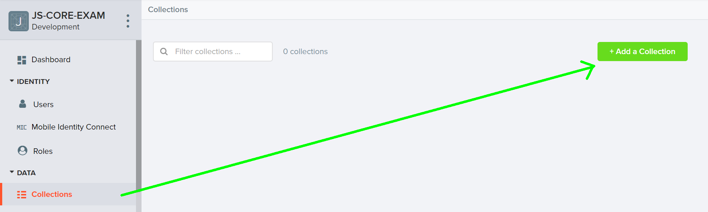

In order to be able to keep track of the likes and listened of each song, you need to allow all users to edit this collection. So go to the properties of the collection:

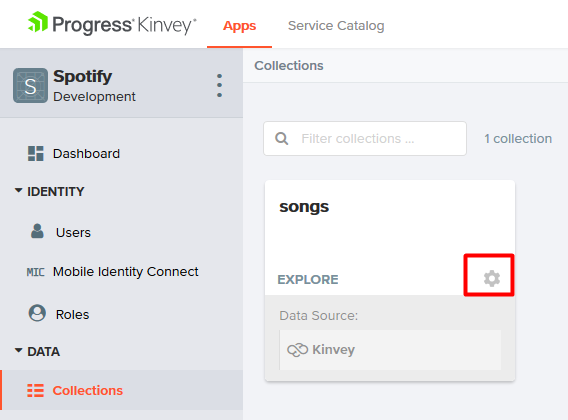

Then go to permissions and edit them to look like this:

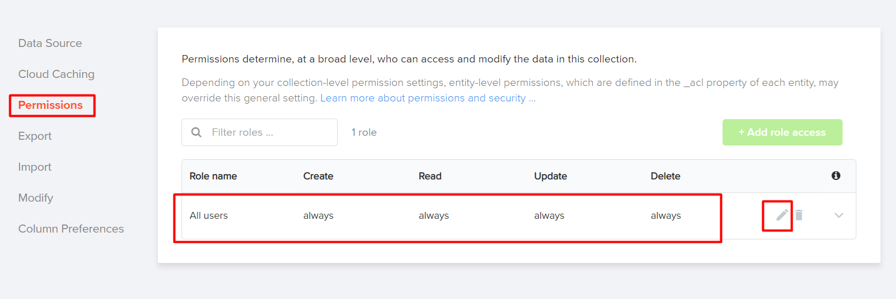

## 2. Test the Kinvey REST Services

Using Postman or other HTTP client tool (you can use Kinvey’s built-in API Console), test the REST service endpoints:

### User Registration (Sign Up)

POST https://baas.kinvey.com/user/app_id/

Request headers:

```
Authorization: Basic base64(app_id:app_secret)
Content-Type: application/json
```

Request body:

```json
{
  "username": "testuser",
  "password": "testuserpass890"
}
```

Response: 201 Created

```json
{
    "_id": "59930c78a743e20c7d3fca77",
    "username": "testuser",
    "password": "testuserpass890"
}
```

Error response: 409 Conflict

```json
{ "error": "UserAlreadyExists", "description": "This username is already taken. Please retry your request with a different username",  "debug": "" }
```

Error response: 401 Unauthorized

```json
{ "error": "InvalidCredentials", "description": "Invalid credentials. Please retry your request with correct credentials", "debug": "" }
```

The request needs "Basic" authentication. Use the Kinvey App Key and Kinvey App Secret as credentials.


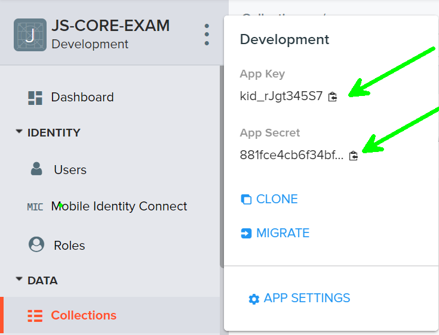

### User Login

POST https://baas.kinvey.com/user/app_id/login

Request headers:

```
Authorization: Basic base64(app_id:app_secret)
Content-Type: application/json
```

Request body:

```json
{
  "username": "testuser",
  "password": "testuserpass890"
}
```

Response: 200 OK

```json
{
  "_id": "59930c78a743e20c7d3fca77",
  "username": "testuser"
  "_kmd": {
    "authtoken": "8e6471bc-3712-4cfb-b92e-50e62a0c80….Duj5fHdM /7XHIe6KdY="
    …
  },
  …
}
```

Error response: 401 Unauthorized

```json
{ "error": "InvalidCredentials", "description": "Invalid credentials. Please retry your request with correct credentials", "debug": "" }
```

Successful login returns an "authtoken" which is later used to authenticate the CRUD operations.

### User Logout

POST https://baas.kinvey.com/user/app_id/_logout 

Request headers

```
Authorization: Kinvey authtoken
```

Response: 204 No Content


Error response: 401 Unauthorized

```json
{ "error": "InvalidCredentials", "description": "Invalid credentials. Please retry your request with correct credentials", "debug": "" }
```

To logout, you need to provide the "authtoken" given by login / register as "Kinvey" authorization header.

### List all Songs

GET https://baas.kinvey.com/appdata/app_id/songs?query={}&sort={}

Request headers:

```
Authorization: Kinvey authtoken
```

Response: 200 OK

```json
[{
   "title":"Better",
   "artist":"Khalid",
   "imageURL":"https://i.ytimg.com/vi/KkOF8UiB7u8/maxresdefault.jpg",
   "likes":"0",
   "listened":"3",
   "_acl":
   {
      "creator":"5bfd4674682ae23931b4f91c"
   },
   "_kmd":
   {
      "lmt":"2018-11-28T15:25:24.521Z",
      "ect":"2018-11-28T14:55:00.958Z"
   }
}, …]
```

Error response: 401 Unauthorized

```json
{ "error": "InvalidCredentials", "description": "Invalid credentials. Please retry your request with correct credentials", "debug": "" }
```

### Create Song

POST https://baas.kinvey.com/appdata/app_id/songs

Reqest headers

```
Authorization: Kinvey authtoken
Content-Type: application/json
```

Request body:

```json
{
	"title": "Better",
	"artist": "Khalid",
	"imageURL": "https://i.ytimg.com/vi/KkOF8UiB7u8/maxresdefault.jpg",
	"likes": 0,
	"listened": 0
}
```

Response: 201 Created

```json
{
    "title": "Better",
    "artist": "Khalid",
    "imageURL": "https://i.ytimg.com/vi/KkOF8UiB7u8/maxresdefault.jpg",
    "likes": 0,
    "listened": 0,
    "_acl": {
        "creator": "5bfd4674682ae23931b4f91c"
    },
    "_kmd": {
        "lmt": "2018-11-28T15:39:58.801Z",
        "ect": "2018-11-28T15:39:58.801Z"
    },
    "_id": "5bfeb6ce682ae23931bf7d26"
}
```

Error response: 401 Unauthorized

```json
{ "error": "InvalidCredentials", "description": "Invalid credentials. Please retry your request with correct credentials", "debug": "" }
```

### Like Song

PUT https://baas.kinvey.com/appdata/app_id/songs/song_id

Request headers

```
Authorization: Kinvey authtoken
Content-Type: application/json
```

Request body:

```json
{
	"title": "Better",
	"artist": "Khalid",
	"imageURL": "https://i.ytimg.com/vi/KkOF8UiB7u8/maxresdefault.jpg",
	"likes": 1,
	"listened": 0
}
```

Response: 200 Ok

```json
{
    "title": "Better",
    "artist": "Khalid",
    "imageURL": "https://i.ytimg.com/vi/KkOF8UiB7u8/maxresdefault.jpg",
    "likes": 1,
    "listened": 0,
    "_id": "5bfeb6ce682ae23931bf7d26",
    "_acl": {
        "creator": "5bfd4674682ae23931b4f91c"
    },
    "_kmd": {
        "lmt": "2018-11-28T15:45:13.760Z",
        "ect": "2018-11-28T15:39:58.801Z"
    }
}
```

Error response: 401 Unauthorized

```json
{ "error": "InvalidCredentials", "description": "Invalid credentials. Please retry your request with correct credentials", "debug": "" }
```

### Listen Song

PUT https://baas.kinvey.com/appdata/app_id/songs/song_id

Request headers

```
Authorization: Kinvey authtoken
Content-Type: application/json
```

Request body

```json
{
	"title": "Better",
	"artist": "Khalid",
	"imageURL": "https://i.ytimg.com/vi/KkOF8UiB7u8/maxresdefault.jpg",
	"likes": 1,
	"listened": 1
}
```

Response: 200 Ok

```json
{
    "title": "Better",
    "artist": "Khalid",
    "imageURL": "https://i.ytimg.com/vi/KkOF8UiB7u8/maxresdefault.jpg",
    "likes": 1,
    "listened": 1,
    "_id": "5bfeb6ce682ae23931bf7d26",
    "_acl": {
        "creator": "5bfd4674682ae23931b4f91c"
    },
    "_kmd": {
        "lmt": "2018-11-28T15:45:13.760Z",
        "ect": "2018-11-28T15:39:58.801Z"
    }
}
```

Error response: 401 Unauthorized

```json
{ "error": "InvalidCredentials", "description": "Invalid credentials. Please retry your request with correct credentials", "debug": "" }
```

### My Songs

GET https://baas.kinvey.com/appdata/app_id/songs?query={"_acl.creator":"${user_id}"}

Request headers

```
Authorization: Kinvey authtoken
```

Response: 200 OK

```json
[
    {
        "_id": "5bfeb6ce682ae23931bf7d26",
        "title": "Better",
        "artist": "Khalid",
        "imageURL": "https://i.ytimg.com/vi/KkOF8UiB7u8/maxresdefault.jpg",
        "likes": 2,
        "_acl": {
            "creator": "5bfd4674682ae23931b4f91c"
        },
        "_kmd": {
            "lmt": "2018-11-28T16:10:15.621Z",
            "ect": "2018-11-28T15:39:58.801Z"
        }
    },…
]
```

Error response: 401 Unauthorized

```json
{ "error": "InvalidCredentials", "description": "Invalid credentials. Please retry your request with correct credentials", "debug": "" }
```

## 3. Spotify – HTML and CSS

You аre given the Web design of the application as HTML + CSS files.

- Initially all views and forms are shown by the HTML. Your application may hide by CSS (display: none) or delete from the DOM all unneeded elements or just display the views it needs to display.
- You may render the views / forms / components with jQuery or Handlebars.

Important: don’t change the elements’ class name and id. Don’t rename form fields / link names / ids. You are allowed to add data attributes to any elements. You may modify href attributes of links and add action/method attributes to forms, to allow the use of a routing library.

## 4. Spotify Client-Side Web Application

Design and implement a client-side front-end app (SPA) for managing songs. Implement the functionality described below.

### Notifications (5 pts)

The application should notify the users about the result of their actions.

- In case of successful action an informational (green) notification message should be shown, which disappears automatically after 3 seconds or manually when the user clicks it.


- In case of error, an error notification message (red) should be shown which disappears on user click.


- During the AJAX calls a loading notification message (blue) should be shown. It should disappear automatically as soon as the AJAX call is completed.


- NOTE: You get all 5 point if the notifications contain the right message

### NavBar (5 pts)

Implement a NavBar for the app: navigation links should correctly change the current screen (view).

- Clicking on the links in the NavBar should display the view behind the link (views are sections in the HTML code).
- Your application may hide by CSS (display: none) or delete from the DOM all unneeded elements or just display the views it needs to display.
- The given „Home, All Songs, My Songs, Welcome and logout" should be visible only for logged in users. 

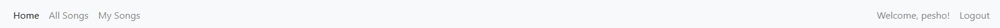

- Anonymous users can only view the login and register. 

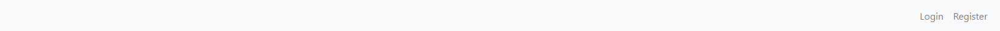

### Home Screen (10 pts)

The initial screen should display the register, login and the initial image + footer.

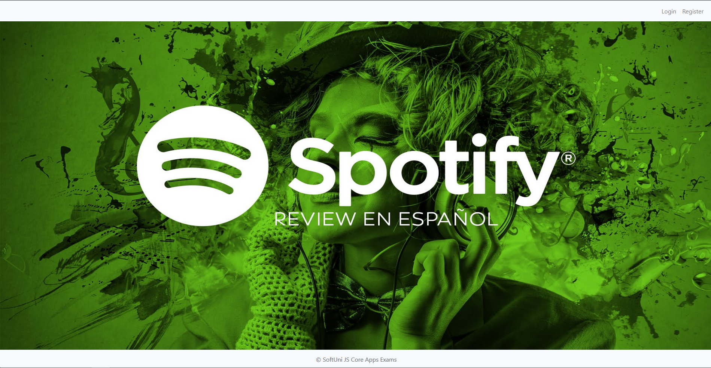

### Register User (10 pts)

By given username and password the app should register a new user in the system.

- You should make the following validations:
  - The username should be at least 3 characters long
  - The password should be at least 6 characters long
- After a successful registration, a notification message "User registration successful." should be displayed and the home page should be displayed again but with the right navbar.
- In case of error (eg. invalid username/password), an appropriate error message should be displayed and the user should be able to try to register again.
- Keep the user session data in the browser’s session storage.
- You should be able to go from the "register" page to the "login" page

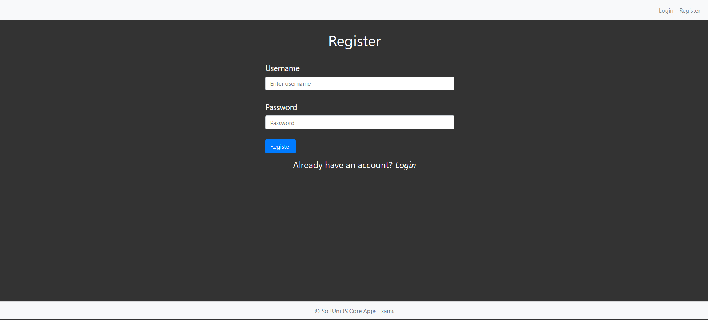

### Login User (5 pts)

By given username and password the app should be able to login an existing user.

- After a successful login, a notification message "Login successful." should be displayed and the user home screen should be displayed.
- In case of error, an appropriate error message should be displayed and the user should be able to fill the login form again.
- Keep the user session data in the browser’s session storage.
- Clear all input fields after successful login.
- You should be able to go from the "login" to the "register" page


### Logout (5 pts)

Successfully logged in user should be able to logout from the app.

- After a successful logout, a notification message "Logout successful." should be displayed.
- After successful logout, the Sign In screen should be shown.
- The "logout" REST service at the back-end should be obligatory called at logout.
- All local information in the browser (user session data) about the current user should be deleted.

### Logged In All Songs (25 pts)

Successfully logged users should be welcomed by the home screen. They should also be able to see the "all songs" view, which must have the following:

- The songs should be listed in the format as shown in the Web design (see the screenshot below).
- The songs must be sorted as follows:
  - First come the songs that are not created by the current user, sorted by likes in descending
  - Then come the songs that are from the current user sorted by likes in descending then by "listened" count in descending
- Each song has title, image, artist, likes, listened counter.
- There are two possibilities for the songs
  - The song was created by the current user:

    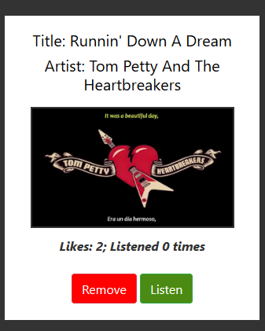

  - The song was not created by the current user:

    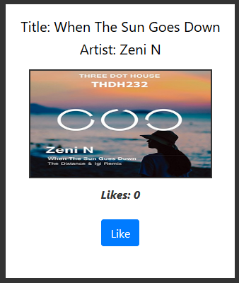

- The "all songs" view should look like this:

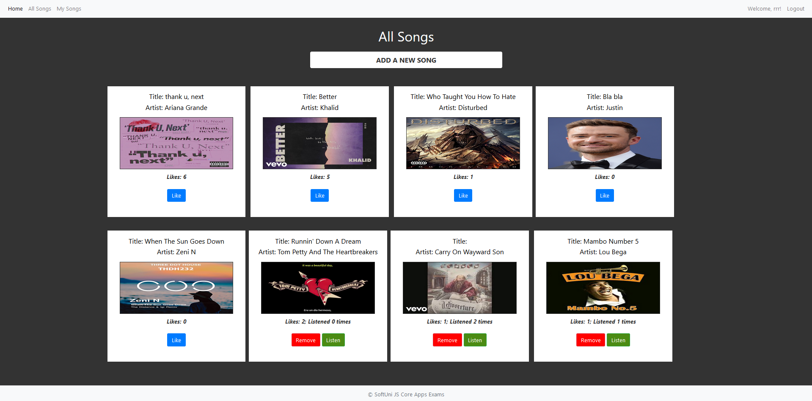

### Add Song Screen (10 pts)

Logged in users can add songs. Clicking the [Add a new song] link should open a form.

- You should make some validations:
  - The title should be at least 6 characters long
  - The artist should be at least 3 characters long
  - The image should start with "http://" or "https://"
- After a successful song creation, a notification message "Song created successfully." should be displayed and the all songs page should be shown. 
- The inputs in the form should be cleared

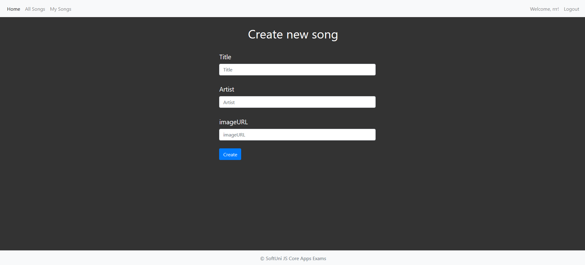

### ike a Song (5 pts)

Users should be able to like songs that are not theirs. Clicking the [Like] link on each song should increase the likes of the particular song. Each user can like a song unlimited times.

- After a successful song update, a notification message "Liked!" should be displayed. 

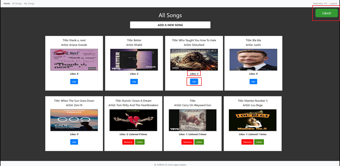

### Listen a Song (5 pts)

Users should be able to listen songs that are theirs. Clicking the [Listen] link on each song should increase the listen counter of the particular song. A user can listen his songs unlimited amount of times

- After a successful song update, a notification message "You just listened {songName}" should be displayed. 

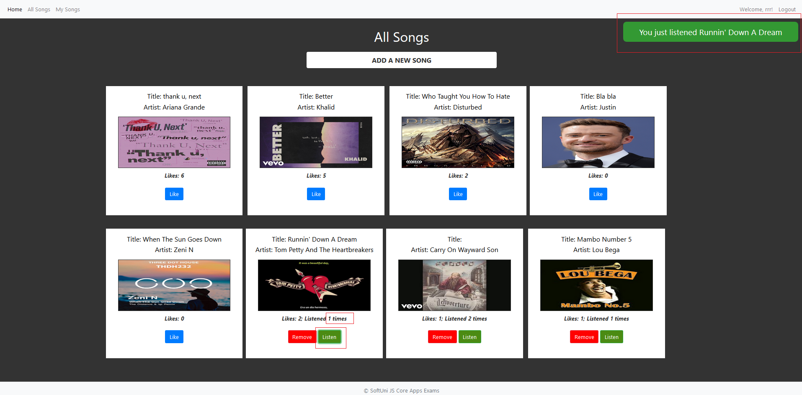

### Delete Song (5 pts)

Song creators should be able to delete their own songs by clicking the [Remove] button.

- After successful pet delete a notification message "Song removed successfully!" should be displayed and the all songs view should be shown.

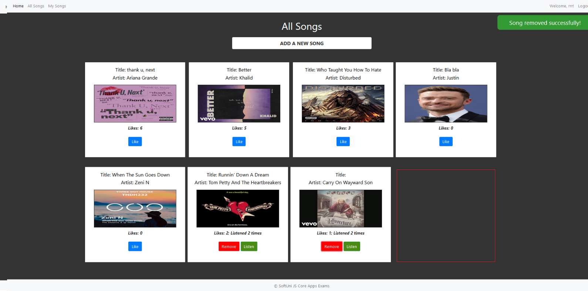

- Deleting works immediately, with no confirmation.

### My Songs (10 pts)

Each user should be able to view his own songs by clicking [My Songs].

- The songs should be listed like in the all songs section, except the user should see only the songs that he created.
- The songs should be ordered first by the amount of likes in descending, then by the "listened" counter in descending

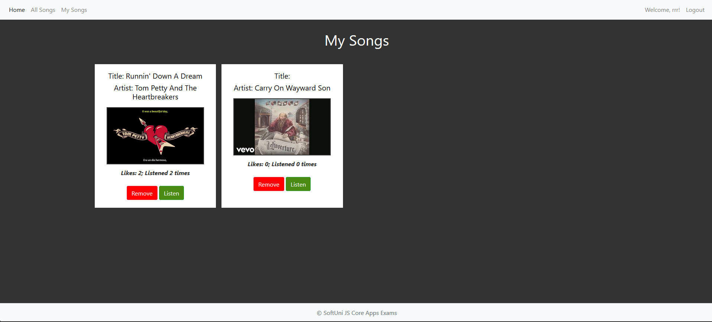

### 5. Submitting Your Solution

Place in a ZIP file your project folder. Exclude the node_modules folder. Upload the archive to the Judge.

<p><b>Document with tasks description: <a href="./resources/Spotify_Description.docx">Spotify_Description.docx</a></b></p>

<p><b>Skeleton: <a href="./resources/Spotify_Skeletona">Spotify_Skeletona</a></b></p>

<p><b>Solution: <a href="./spotify">Spotify SPA</a></b></p>

### Test users

username | password
---------|----------
vas | 123456
aaa | 123456
bbb | 123456
rrr | 123456
sss | 123456